# 🗺️ Med.Health — Fluxos de Usuário

> Documento de referência para a equipe de desenvolvimento.
> Contém os diagramas de fluxo de todas as jornadas críticas, organizados por **perfil de acesso**.

---

## Índice

1. [Fluxos Compartilhados](#1-fluxos-compartilhados-todos-os-perfis)
2. [Médico/ADM (Administrador)](#2-médicoadm-administrador)
3. [Médico (Atendimento)](#3-médico-atendimento)
4. [Secretária](#4-secretária)

---

## 1. Fluxos Compartilhados (Todos os perfis)

### 1.1. Autenticação & Onboarding

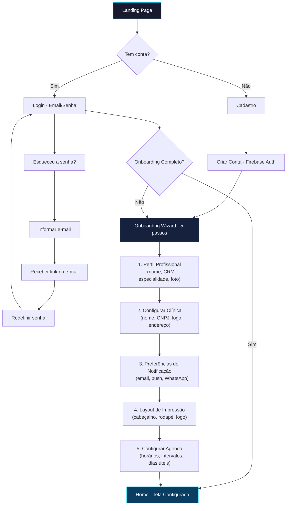

**Recuperação e alteração de senha:** Na tela de Login, o link "Esqueceu a senha?" leva ao fluxo acima (informar e-mail → receber link → redefinir senha → voltar ao Login). Usuário já logado pode alterar senha em **Configurações > Preferências de Usuário** (seção Dados e Segurança); essa opção aparece apenas para contas com provedor e-mail/senha (UC-018c).

### 1.2. Navegação Principal (Menu Lateral)

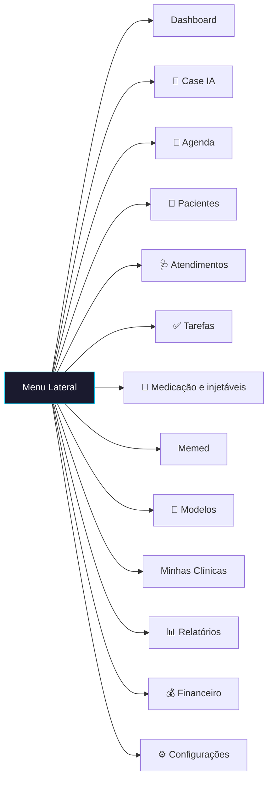

**Minhas Clínicas** agrupa: Assinatura, Profissionais da Saúde, Outros Profissionais, Minhas Unidades, Perfil da Unidade. **Configurações** agrupa as abas (Dados da Clínica, Preferências de Usuário, Agenda, Layout de Impressão, etc.) e a rota Automação (IA).

### 1.3. Convite e aceite de profissional

> Dono ou admin convida; o convidado recebe o e-mail, abre o link, cria conta (ou faz login) e passa a acessar o app com menu filtrado pelo role. Ver [CASO_DE_USO_SECRETARIA_CONVITE.md](../operations/CASO_DE_USO_SECRETARIA_CONVITE.md).

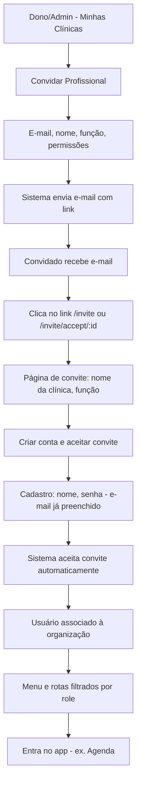

---

## 2. Médico/ADM (Administrador)

> O Médico/ADM possui **acesso total** ao sistema. Além de atender pacientes, ele gerencia a clínica, equipe, finanças e configurações.

### 2.1. Gestão Financeira Completa

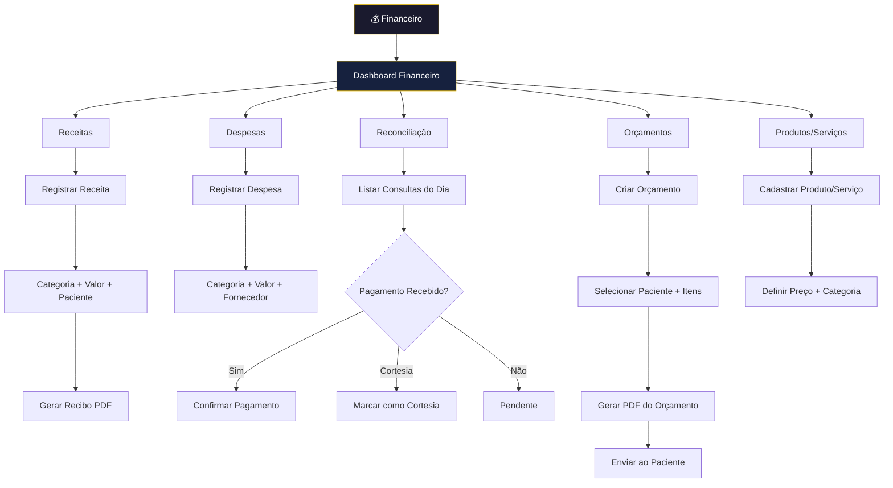

### 2.2. Relatórios e BI

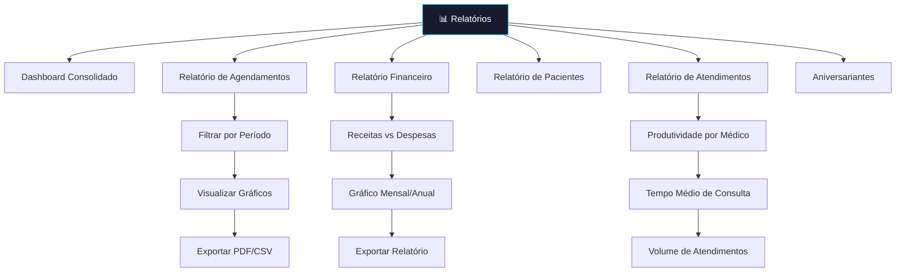

### 2.3. Configurações da Clínica

As abas abaixo refletem o menu lateral em **Configurações** (secretária vê apenas Preferências de Usuário).

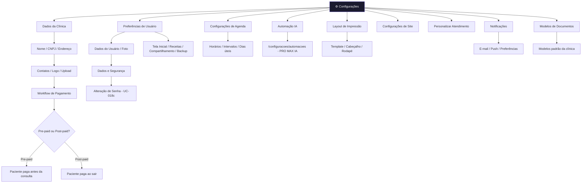

### 2.4. Gestão de Modelos e Templates

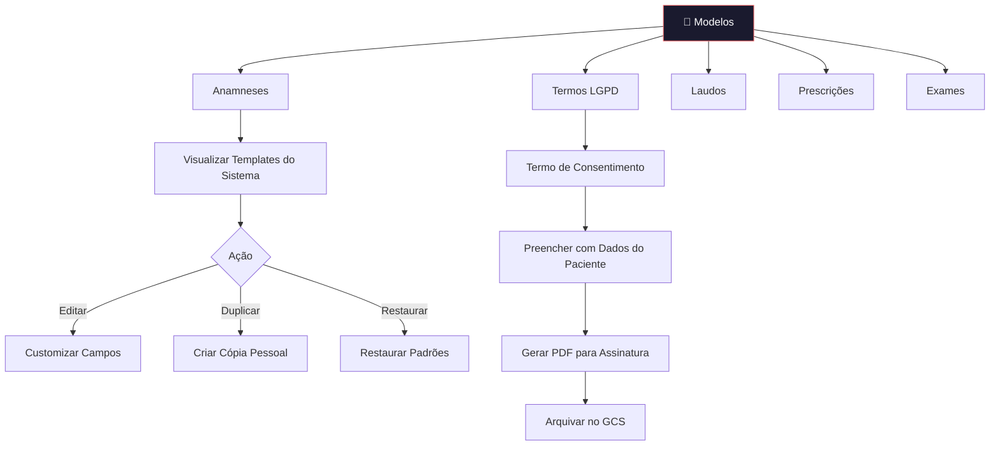

### 2.5. Gestão de Tarefas e Automação

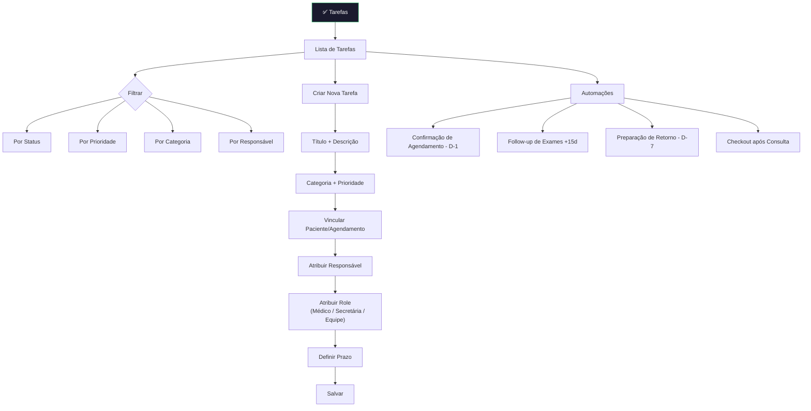

### 2.6. Gestão de Assinatura, Página /planos e Cupons

```mermaid
flowchart TD
    subgraph PlanosApp [/planos — Fluxo Oficial/]
        P0[Landing ou CTA interno] --> P1[/planos]
        P1 --> P2{URL tem ?plan=xxx?}
        P2 -->|Sim| P3{Usuário logado?}
        P2 -->|Não| P6[Usuário escolhe plano na matriz]

        P3 -->|Não| P4[Redirect /login?plan=xxx]
        P4 --> P5[Login / Onboarding]
        P5 --> P1b[/planos?plan=xxx (retorno)]

        P3 -->|Sim| P7[createCheckoutSession(uid, planKey)]
        P6 --> P7

        P7 --> P8[Stripe Checkout com plano pré-selecionado]
        P8 --> P9[Extensão Stripe grava customers/uid/subscriptions]
        P9 --> P10[Trigger syncStripeSubscription]
        P10 --> P11[Org atualizada com limits + currentUsage]
    end

    subgraph UpgradeGestao [Gestão e Assinatura]
        G1[Configurações > Gestão e Assinatura] --> G2{planId === PRO_MAX_IA
        e status = active/trialing?}
        G2 -->|Sim| G3[Ocultar botão "Fazer Upgrade"]
        G2 -->|Não| G4[Botão "Fazer Upgrade" leva a /planos]
        G1 --> G5[Botão "Gerenciar Plano" abre portal Stripe]
    end

    subgraph CupomLink [Assinatura via Link/Cupom Externo]
        B1[Usuário recebe Payment Link com cupom] --> B2[Checkout Stripe direto (fora do app)]
        B2 --> B3[Stripe cria assinatura]
        B3 --> B4{Extensão grava em customers/{uid}?}
        B4 -->|"Path = firebaseUid"| B5[Trigger dispara - dados completos]
        B4 -->|"Outro path / não grava"| B6[Trigger NÃO dispara]
        B6 --> B7[Org pode ficar sem limits/currentUsage]
        B7 --> B8[Banner amarelo: Dados incompletos]
        B8 --> B9[Usuário clica "Reparar dados"]
        B9 --> B10[repairSubscriptionData garante limits + currentUsage]
    end
```

**Boas práticas e prevenção de problemas com cupom:**
- **Canal recomendado**: Sempre direcionar campanhas e cupons para o fluxo oficial (`/planos?plan=xxx`), garantindo login e `createCheckoutSession` pelo app.
- **Após login ou onboarding**: Se houver `?plan=xxx`, o usuário é redirecionado para `/planos?plan=xxx`, que dispara o checkout com o plano correto.
- **Payment Link direto**: Pode não gravar em `customers/{firebaseUid}/subscriptions`; nesses casos, usar o banner de "Dados incompletos" e o botão "Reparar dados" ou acionar o suporte.
- **Função de reparo**: `repairSubscriptionData` continua como fallback para restaurar `limits` e `currentUsage`, inclusive para usuários com cupons PRO MAX + IA.

**Fluxo completo Landing → Pagamento:** Ver [FLUXO_ASSINATURA_LANDING_PAGAMENTO.md](./FLUXO_ASSINATURA_LANDING_PAGAMENTO.md) para documentação detalhada, modelo de dados e garantias contra perda de acesso.

**Checkout e preços Stripe:**
- Se a sincronização Firestore (products/prices) não tiver os preços, o app usa a callable `createCheckoutSessionCallable`, que obtém os preços via API Stripe.
- Requer `STRIPE_SECRET_KEY` configurada: `firebase functions:config:set stripe.secret="sk_live_xxx"` ou variável de ambiente no deploy.
- **IDs de produto (v1.23.0):** PRO `prod_U3atEaBlT74UZR`, PRO MAX + IA `prod_U3b1lN1Z2gAcqC` (l = L minúsculo). Ver [STRIPE_CHECKOUT_DEBUG.md](./STRIPE_CHECKOUT_DEBUG.md).

### 2.7. Assistentes IA

> Recurso acessível por rota `/assistantes`, com gate de assinatura (feature `assistantes`). Dono ou admin configura/opera assistentes de WhatsApp, qualificação de leads e agendamento automático (UC-020).

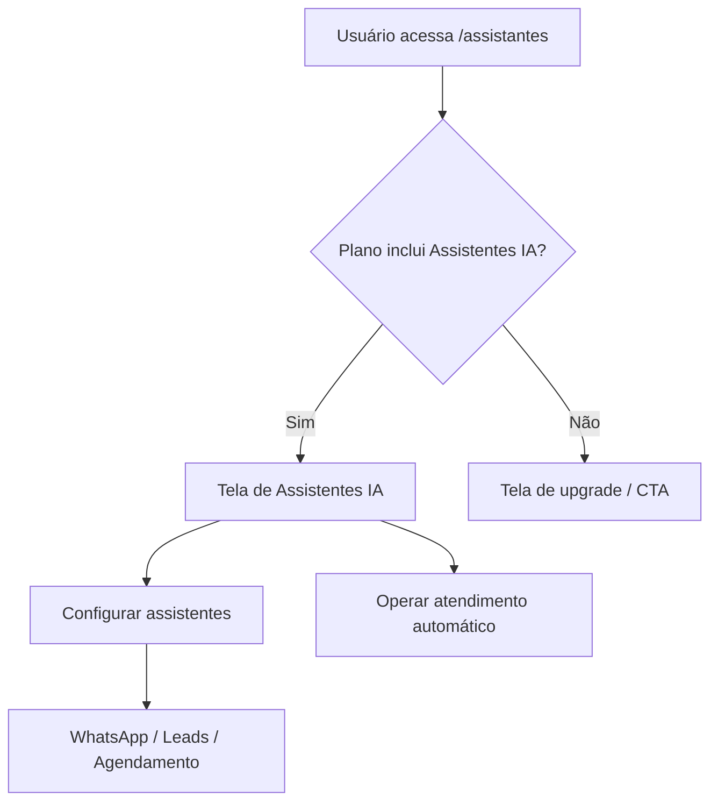

---

## 3. Médico (Atendimento)

> O perfil Médico é focado no **fluxo clínico**: atendimento, prontuário, IA e acompanhamento do paciente.

### 3.1. Fluxo de Atendimento Completo (Consulta)

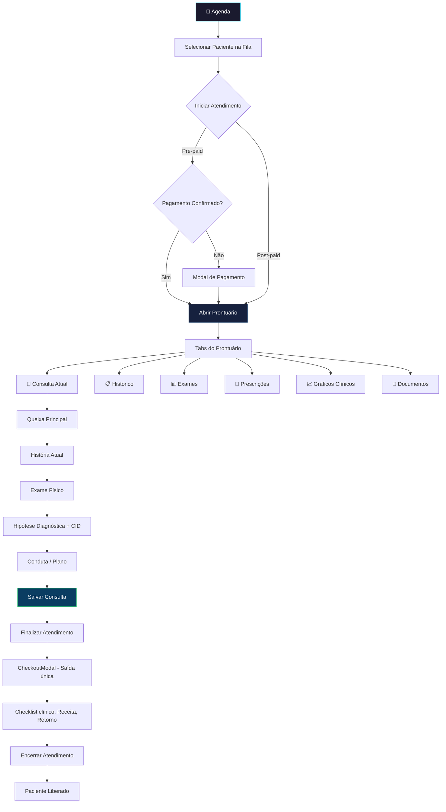

### 3.1b. Ciclo de Vida do Status (Em Sala / Em Atendimento)

> **Regras de negócio (v1.27.0):** O status do agendamento reflete em tempo real o estado das consultas na fila de Atendimentos.

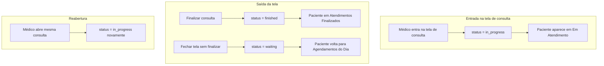

| Ação | Status resultante |
|------|-------------------|
| Entrar na tela de consulta | `in_progress` |
| Finalizar consulta | `finished` |
| Descartar atendimento | `waiting` |
| Fechar (X ou voltar) sem finalizar | `waiting` |
| Reabrir a mesma consulta | `in_progress` |

**Botões na página Atendimentos:** "Ver Prontuário" e "Iniciar Atendimento" navegam para a tela de consulta com `appointmentId`; ao entrar, o status passa a `in_progress` automaticamente.

**URL da consulta:** Acesso à tela de consulta é feito por `/consulta/:patientId` (opcionalmente `?appointmentId=...`). A partir de Atendimentos ou Agenda, a navegação inclui `appointmentId` na query para marcar o status do agendamento como `in_progress` e vincular a consulta ao agendamento.

### 3.2. Scribe — IA de Transcrição Ambiental

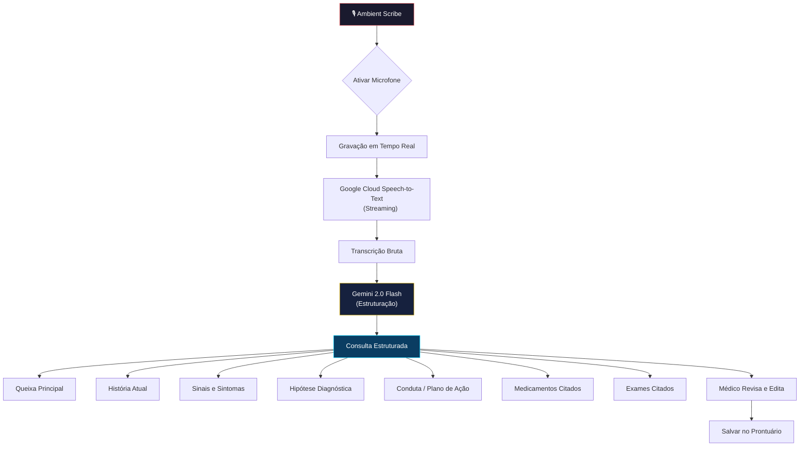

### 3.3. Case IA — Raciocínio Clínico

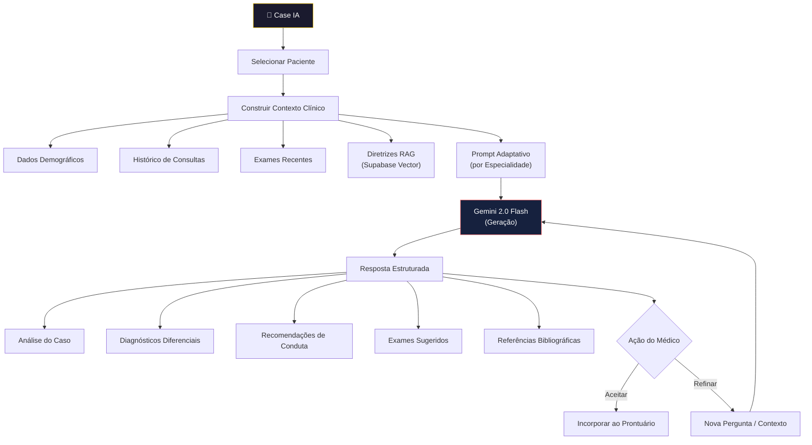

### 3.4. Gestão de Pacientes (Visão Médica)

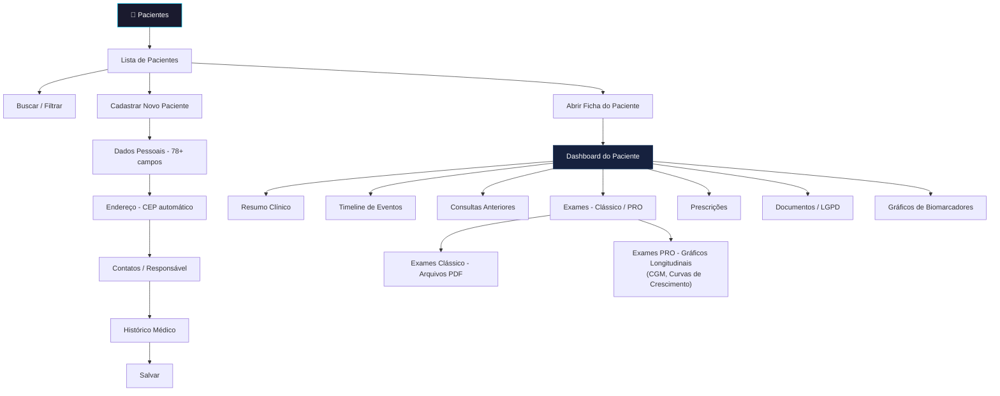

### 3.5. Finalização e Checkout (Saída Única)

> **Saída única:** Sidebar "FINALIZAR", Header "Verificar pendências" e botão "X" levam ao mesmo CheckoutModal. O fluxo de pagamento fica na Agenda (recepção) e no Financeiro/Reconciliação.

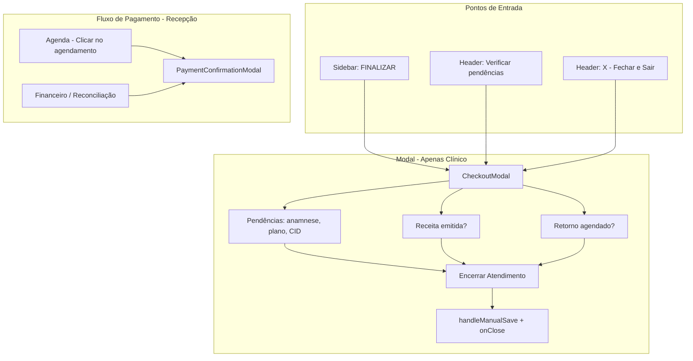

### 3.6. Agendamento de Retorno Pré-definido

> Fluxo para o médico pré-definir o retorno do paciente durante o checkout, com suporte a protocolos por procedimento (ex: implante hormonal = 3 meses).

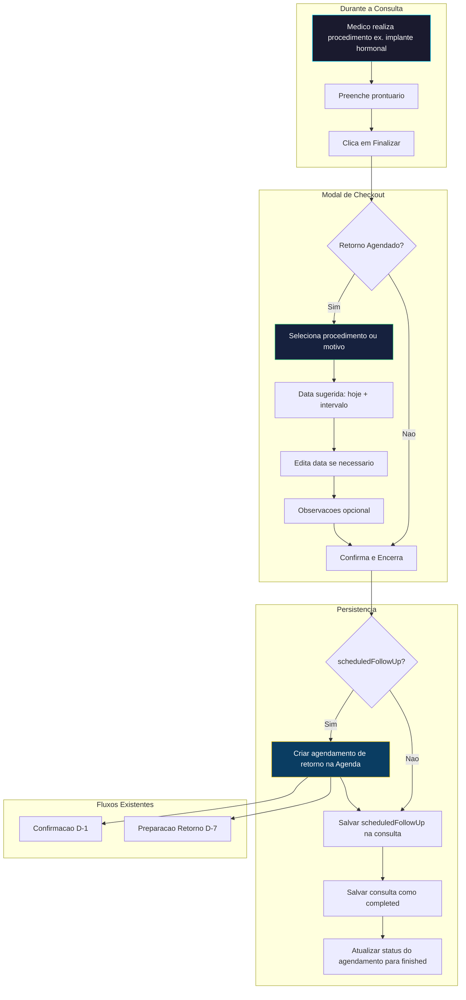

**Procedimentos com intervalo padrão:**

| Procedimento        | Intervalo | Uso típico                    |
|---------------------|-----------|-------------------------------|
| Implante hormonal   | 3 meses   | Retorno para exames           |
| Ajuste de dose      | 1 mês     | Controle de medicação         |
| Avaliação inicial   | 15 dias   | Primeira consulta pós-diagnóstico |
| Retorno rotineiro   | 3 meses   | Pacientes estáveis            |
| Retorno em 6 meses  | 6 meses   | Acompanhamento semestral      |
| Personalizado       | 1–12 meses| Intervalo livre               |

**Onde:** CheckoutModal (ao finalizar atendimento). O retorno é criado na Agenda com o mesmo profissional e unidade da consulta atual.

---

### 3.7. Exames PRO — Gráficos Clínicos

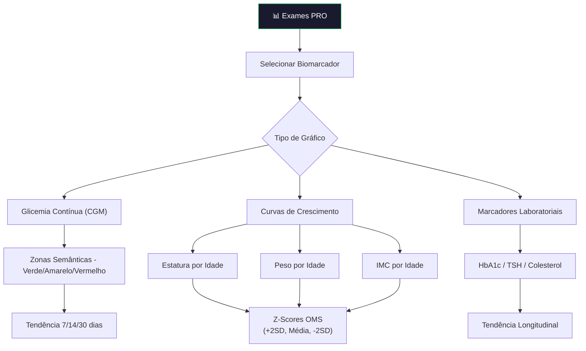

---

## 4. Secretária

> A Secretária é o **pivô operacional** da clínica. Seu foco é na gestão de agenda, check-in/check-out de pacientes e tarefas administrativas.

### 4.1. Gestão da Agenda

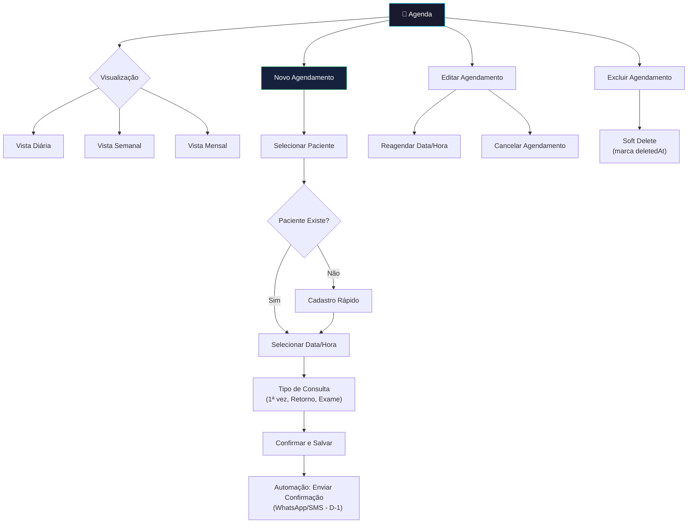

### 4.2. Fluxo de Check-in / Check-out (Kanban da Fila)

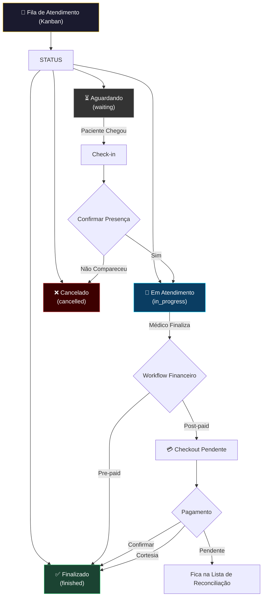

### 4.3. Cadastro Rápido de Paciente (pela Secretária)

```mermaid
flowchart TD
    CAD[Cadastro Rápido] --> D1[Nome Completo]
    D1 --> D2[CPF + Telefone]
    D2 --> D3[Data de Nascimento]
    D3 --> D4[Email - Opcional]
    D4 --> D5[CEP → Endereço Automático]
    D5 --> SAVE[Salvar]
    SAVE --> RETAG[Retornar à Agenda para Agendar]

    style CAD fill:#1a1a2e,stroke:#00d4ff,color:#fff
```

### 4.4. Tarefas da Secretária

```mermaid
flowchart TD
    TSK[✅ Tarefas - Visão Secretária] --> MINE[Minhas Tarefas]
    MINE --> TF{Filtrar por Status}
    TF --> TODO[📋 A Fazer]
    TF --> PROG[🔄 Em Progresso]
    TF --> DONE[✅ Concluída]

    MINE --> TIPOS[Tipos Comuns]
    TIPOS --> T1["📞 Confirmação de Agendamento
    (Automática - D-1)"]
    TIPOS --> T2["📋 Preparação de Retorno
    (Automática - D-7)"]
    TIPOS --> T3["🧪 Follow-up de Exames
    (Automática +15d)"]
    TIPOS --> T4["💰 Checkout Pendente
    (Pós-consulta)"]
    TIPOS --> T5[📝 Tarefas Manuais do Médico]

    T1 --> ACT1[Ligar / Enviar WhatsApp]
    ACT1 --> ACT2{Confirmado?}
    ACT2 --> |Sim| MARK[Marcar como Concluída]
    ACT2 --> |Não| REAG[Reagendar / Cancelar]

    style TSK fill:#1a1a2e,stroke:#2ecc71,color:#fff
```

### 4.5. Reconciliação Financeira (Visão Secretária)

```mermaid
flowchart TD
    REC[💰 Reconciliação] --> DIA[Consultas Finalizadas do Dia]
    DIA --> LIST[Lista de Pendências]

    LIST --> ITEM[Selecionar Consulta]
    ITEM --> ACT{Ação}
    ACT --> |Pagamento Recebido| PAY[Confirmar Pagamento]
    PAY --> PAY1[Tipo: Dinheiro / Cartão / PIX]
    PAY1 --> PAY2[Registrar Valor]
    PAY2 --> PAY3[Gerar Recibo]

    ACT --> |Cortesia/Retorno| CORT[Marcar como Cortesia]
    ACT --> |Pendente| PEND[Manter Pendente]

    style REC fill:#1a1a2e,stroke:#e6b800,color:#fff
```

---

## 5. Fluxo Global — Ciclo de Vida do Agendamento

> Este diagrama mostra o **ciclo completo** de um agendamento, cruzando os três perfis.

```mermaid
stateDiagram-v2
    direction LR

    [*] --> Agendado: Secretária cria

    state "Confirmação" as Confirmacao {
        Agendado --> Confirmado: Automação D-1
        Agendado --> Cancelado: Paciente cancela
    }

    Confirmado --> Aguardando: Paciente chega (Check-in)

    state "Atendimento" as Atendimento {
        Aguardando --> EmAtendimento: Médico inicia
        EmAtendimento --> Finalizado: Médico finaliza
    }

    state "Financeiro" as FinanceiroState {
        Finalizado --> CheckoutPendente: Post-paid
        Finalizado --> Concluido: Pre-paid (já pago)
        CheckoutPendente --> Concluido: Secretária confirma pagamento
        CheckoutPendente --> Cortesia: Marcado como cortesia
    }

    Concluido --> [*]
    Cortesia --> [*]
    Cancelado --> [*]
```

---

## 6. Matriz de Permissões por Perfil

| Funcionalidade | Médico/ADM | Médico | Secretária |
|:---|:---:|:---:|:---:|
| **Agenda — Criar/Editar/Excluir** | ✅ | ✅ | ✅ |
| **Pacientes — Cadastro Completo** | ✅ | ✅ | ✅ (parcial) |
| **Prontuário — Consultar/Editar** | ✅ | ✅ | ❌ |
| **Scribe — Transcrição IA** | ✅ | ✅ | ❌ |
| **Case IA — Raciocínio Clínico** | ✅ | ✅ | ❌ |
| **Financeiro — Dashboard Completo** | ✅ | ❌ | ❌ |
| **Financeiro — Reconciliação** | ✅ | ❌ | ✅ |
| **Financeiro — Recibos** | ✅ | ❌ | ✅ |
| **Relatórios — Todos** | ✅ | ✅ (parcial) | ❌ |
| **Modelos/Templates** | ✅ | ✅ | ❌ |
| **Configurações — Clínica** | ✅ | ❌ | ❌ |
| **Configurações — Pessoal** | ✅ | ✅ | ✅ |
| **Tarefas — Gestão** | ✅ | ✅ | ✅ (próprias) |
| **Tarefas — Criar Automação** | ✅ | ❌ | ❌ |
| **Exames PRO — Gráficos** | ✅ | ✅ | ❌ |

---

> **Legenda de Cores nos Diagramas:**
> - 🔵 Azul (`#00d4ff`): Fluxos de navegação e agenda
> - 🟡 Dourado (`#e6b800`): Fluxos financeiros
> - 🟢 Verde (`#2ecc71`): Ações de conclusão e tarefas
> - 🔴 Vermelho (`#ff6b6b`): Templates e ações destrutivas
> - 🟣 Roxo (`#7b68ee`): Configurações

---

*Med.Health — Inteligência Médica para Todas as Especialidades*
