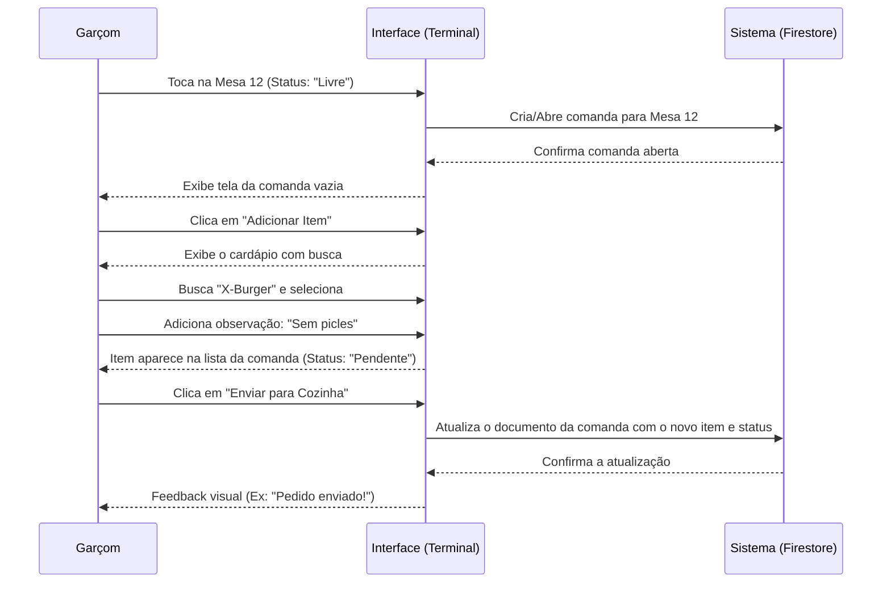
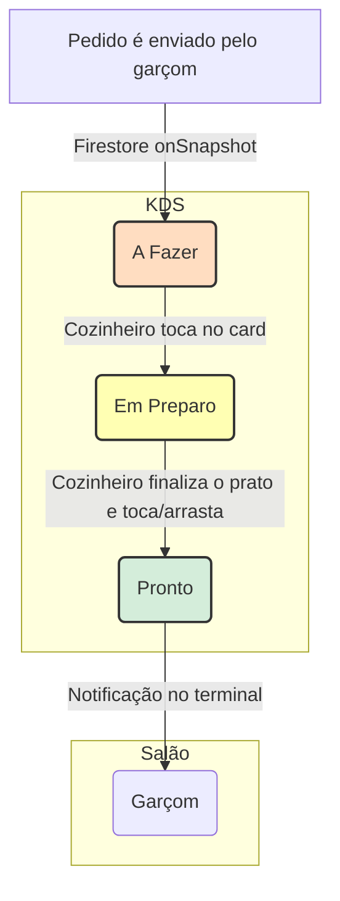
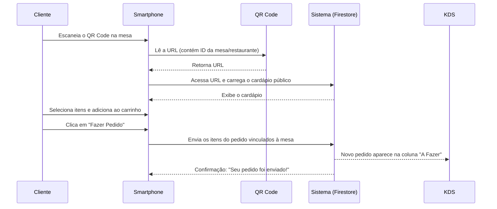

# Fluxos de Usuário (UX Flows) - Vibefood

Este documento detalha as jornadas críticas do usuário dentro do sistema Vibefood, utilizando diagramas de fluxo para ilustrar a interação entre o usuário, a interface e o sistema.

## 1. Mapeamento de Jornadas Críticas

-   **A. Jornada do Garçom (Acesso via PIN):** Autenticação rápida em terminais compartilhados.
-   **B. Jornada do Garçom (Lançamento de Pedido):** O fluxo principal de atendimento no salão.
-   **C. Jornada da Cozinha (KDS):** O ciclo de vida de um pedido na cozinha.
-   **D. Jornada do Cliente (Autoatendimento):** Pedidos feitos diretamente pelo cliente via QR Code.

---

### A. Jornada do Garçom (Acesso via PIN)

-   **Contexto:** Terminal coletivo ou celular da equipe no salão.
-   **Objetivo:** Autenticar e estar pronto para atender em menos de 5 segundos.
-   **Heurística de UX:** "Aceleração de Uso".

```mermaid
graph TD
    A[Abre a URL do terminal] --> B[Tela de Login de Garçom];
    B --> C{Seleciona o próprio nome na lista};
    C --> D[Interface para inserir o PIN];
    D --> E{Digita o PIN de 4 dígitos};
    E --> F[Sistema valida o PIN];
    F -- Válido --> G[Acesso liberado: Exibe a tela de Mesas/Comandas];
    F -- Inválido --> H[Mensagem de erro: "PIN inválido"];
    H --> D;
```

---

### B. Jornada do Garçom (Lançamento de Pedido)

-   **Contexto:** Atendendo um cliente em uma mesa.
-   **Objetivo:** Adicionar itens a uma comanda e enviá-los à cozinha com o mínimo de toques.



---

### C. Jornada da Cozinha (KDS - Kitchen Display System)

-   **Contexto:** Ambiente de alta pressão na cozinha, utilizando um tablet ou tela.
-   **Objetivo:** Visualizar e gerenciar o fluxo de preparação dos pratos de forma clara.


- **Fluxo:**
  1.  **Notificação:** Um novo pedido aparece na coluna "A Fazer" com um alerta sonoro.
  2.  **Preparação:** O cozinheiro toca no card para movê-lo para "Em Preparo". A cor do card muda.
  3.  **Conclusão:** Ao finalizar, o cozinheiro move o card para "Pronto".
  4.  **Retirada:** O sistema notifica o garçom que o prato está pronto para ser retirado.

---

### D. Jornada do Cliente (Autoatendimento)

-   **Contexto:** Cliente sentado à mesa com seu próprio smartphone.
-   **Objetivo:** Fazer um pedido sem a necessidade de chamar o garçom.



## 2. Padrões de Interface (UI Design)

| Elemento | Padrão Vibefood | Motivação |
| :--- | :--- | :--- |
| **Cores** | Slate-900 / Primary (Neon) | Contraste focado em ambientes escuros (Salão). |
| **Tipografia** | Inter / Outfit | Legibilidade rápida em tablets de baixa resolução. |
| **Toasts** | Temporários (2s) | Não obstruir o grid de pedidos. |
| **Botões** | Área de toque min. 48px | Uso com luvas ou mãos úmidas (Cozinha). |

## 3. Heurísticas de Usabilidade
1.  **Prevenção de Erros:** Confirmação obrigatória para ações destrutivas (ex: cancelar pedido).
2.  **Memória:** O sistema sugere itens baseados nos pedidos anteriores do cliente.
3.  **Status do Sistema:** Indicador de conexão (Online/Offline) sempre visível.